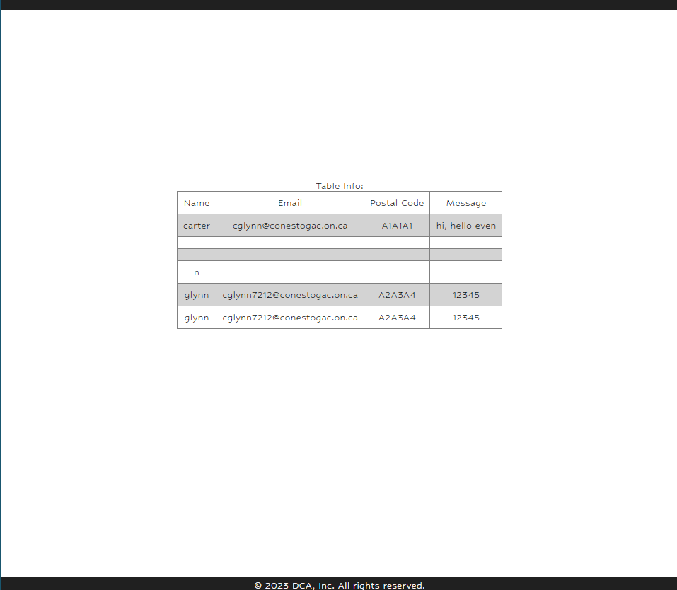

# TCP-Communication  

## Goal  
 - Modify existing Microsoft TCP server and client code
 - Understand the workings of TCP and Telnet
 - Connect TCP server to client
 - Input data to database table from client
 - Display data on PHP webpage

## Description  
Create a TCP client and a TCP server. The programs should be console applications.   
The client lets a user input data for a database table that is used to display data on a PHP-based web-page.   
Client connects to TCP server and sends this data. The TCP server stores this data in the database.   
Verify that the data has been successfully stored through displaying it on the web-page.

 Table with data displayed
